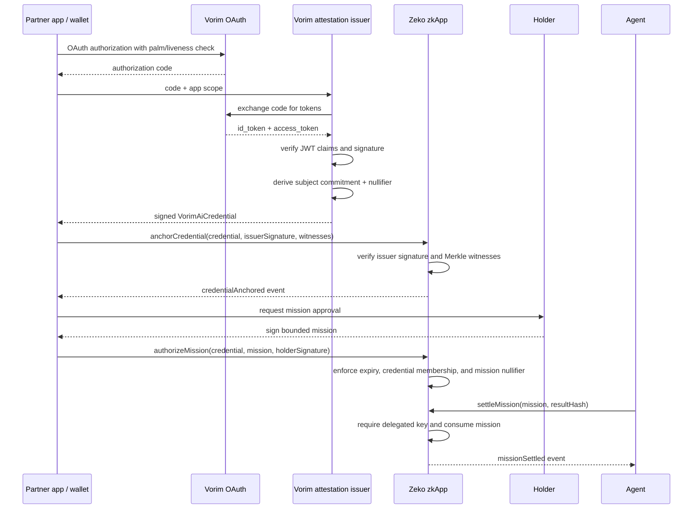

# VorimAI on Zeko

This is a starter zkApp for bringing VorimAI's human/liveness identity layer to Zeko without putting biometric data, OAuth tokens, or stable user identifiers on-chain. It implements the partnership in two steps: anchor a Vorim credential, then turn that credential into a narrowly scoped, one-time mission for an app, agent, wallet, or marketplace.

Vorim handles the palm/liveness OAuth flow off-chain. A Vorim-operated issuer service verifies the OAuth `id_token`, derives privacy-preserving commitments, signs the resulting credential with a Mina/Pallas key, and submits it to this Zeko zkApp. The zkApp verifies the issuer signature, anchors the credential commitment, and burns a nullifier so the same proof-of-human event cannot be replayed for the same scope.

## Architecture



## What The Contract Proves

- The credential was signed by the configured Vorim issuer key.
- The same subject/scope credential was not already anchored.
- The same nullifier was not already spent.
- The public chain sees commitments only: `subjectCommitment`, `scopeHash`, `authContextHash`, and `nullifier`.
- The credential binds a holder Zeko key without putting the Vorim subject identifier on-chain.

## Step 2: Mission-Bound Authorization

`authorizeMission` is the native Zeko upgrade layer. A holder signs a mission that is bound to:

- the anchored Vorim credential commitment;
- a delegate public key for an agent, app, wallet, or marketplace;
- an audience and action hash representing the permitted destination and operation;
- a maximum settlement amount;
- an expiry slot;
- a one-time mission nullifier.

The contract verifies the holder signature, proves the Vorim credential is present in the registry, enforces the credential and mission expiry relationship, and inserts the mission into a separate Merkle root. `settleMission` can only be called by the delegated key and consumes the mission leaf, so the same authorization cannot be replayed.

The contract deliberately does not verify OAuth JWTs in-circuit. That is the issuer service's job. JWT parsing, JWKS lookup, claim validation, and palm/liveness evaluation are better handled off-chain, then converted into a compact Zeko-native signature.

## Files

- `src/VorimAiCredentialRegistry.ts` - o1js smart contract for Zeko.
- `VorimAiCredentialRegistry` implements both `anchorCredential` and the mission-bound `authorizeMission` / `settleMission` flow.
- `src/vorim-oauth.ts` - backend adapter for Vorim OAuth code exchange and credential construction.
- `src/vorim-zeko-adapter.ts` - runtime authorization adapter inspired by the Vorim attachment, with fail-closed fallback handling, modified-payload capture, escalation resolution, and o1js/Poseidon receipt commitments using the existing Mission-Bound Auth receipt vocabulary.
- `src/mock-vorim.ts` - local Vorim runtime mock for day-one demos without a real API key.
- `src/demo-runner.ts` - reusable local Vorim + Zeko flow used by the CLI and browser app.
- `app/` - browser demo for the runtime decision and settlement flow.
- `docs/PROTOCOL_INTEGRATION.md` - explicit boundary for Agent Mission-Bound Auth, x402, Magic City, Santaclawz, Vorim, and Zeko responsibilities.
- `scripts/demo-local.ts` - local Mina/o1js demo covering credential anchoring, mission authorization, and delegated settlement.
- `scripts/demo-vorim-zeko.ts` - full local Vorim decision, receipt commitment, zkApp mission, and signed audit demo.
- `scripts/demo-app-server.ts` - tiny Node server for the browser app and demo API.
- `scripts/deploy-zeko.ts` - Zeko testnet deployment scaffold.
- `scripts/smoke-zeko.ts` - live Zeko smoke covering both partnership steps with a test credential.
- `test/vorim-ai-credential-registry.test.ts` - local contract test.
- `test/vorim-zeko-adapter.test.ts` - adapter tests for allow, modify, escalation, fallback, and settlement mismatch handling.

## Local Run

```bash
npm install
npm run doctor
npm test
npm run demo
```

Run the integrated Vorim + Zeko demo:

```bash
npm run demo:vorim -- allow
npm run demo:vorim -- modify
npm run demo:vorim -- escalate
npm run demo:vorim -- fallback
```

Start the browser app:

```bash
npm run app
```

Then open `http://localhost:4173`. The app uses `MockVorimClient` by default, so it exercises the full local zkApp and signed-audit flow without Vorim credentials. The adapter is structural TypeScript: a real `createVorim(...)` SDK client can be passed to `authorizeZekoAction` as long as it exposes `beforeAction`, `waitForDecisionResolution`, and `emit`.

For real proofs:

```bash
PROOFS_ENABLED=true npm run demo
```

## Protocol Boundary

This repository is a Vorim adapter demo over existing Zeko ecosystem protocols. It does not invent a new protocol or rebrand Santaclawz, x402, Mission-Bound Auth, or Magic City under this project.

The demo uses the established Agent Mission-Bound Auth object names `zk-mission-bundle-v1`, `mission-bound-auth-receipt-v1`, and `mba-registry-v1`; records x402 as the payment rail; records Santaclawz as the external agent rail; and treats Magic City as the compatible orchestration/runtime pattern. See [docs/PROTOCOL_INTEGRATION.md](docs/PROTOCOL_INTEGRATION.md).

## Runtime Authorization Receipt

The demo builds a `mission-bound-auth-receipt-v1` profile after Vorim returns an executable decision. It deliberately differs from the initial attachment in three places:

- `fallback` never settles; the adapter throws before a mission is authorized.
- `modify` hashes and settles the Vorim `modifiedPayload`, while retaining the original intent hash for audit reconciliation.
- `escalate` must resolve through `waitForDecisionResolution`; the resulting receipt records `alg: "P-256"` to preserve the human secure-element signer boundary.

The receipt commitment is a real o1js `Field` from `Poseidon.hash(...)`, not a SHA-256 placeholder. In the local demo that field is bound into `VorimMissionAuthorization.actionHash` and emitted as the settlement `resultHash`, so the signed Vorim audit trail reconciles against the Zeko mission and settlement state.

## Zeko Testnet Deploy

Create `.env` from `.env.example`, fund the deployer on Zeko testnet, then run:

```bash
npm run deploy:zeko
```

Default endpoints:

- `https://testnet.zeko.io/graphql`
- `https://archive.testnet.zeko.io/graphql`

The combined zkApp has been deployed to Zeko testnet at:

`B62qoxnX9dRxQFLy5E5H76NNKL4dk4a37Fadjn6NH2F7AxKAALnSHDs`

The live smoke advanced both roots successfully. It used the deployer as a provisional issuer and a test credential; replace that issuer with a Vorim-controlled key before production use. The smoke script is intended for a fresh deployment because its witness store starts from empty roots:

```bash
export ZEKO_ZKAPP_ADDRESS=<fresh-deployment-address>
npm run smoke:zeko
```

## Vorim Issuer Flow

The issuer service should:

1. Receive the mobile OAuth `code` and intended app `scope`.
2. Exchange the code at `https://api.vorim.ai/oauth2/token`.
3. Verify the `id_token` signature against Vorim's JWKS and validate `iss`, `aud`, `exp`, and nonce/state.
4. Build a `VorimAiCredential` with a KMS-held salt.
5. Sign `issuerAuthorizationMessage(zkappAddress, sequence, credential)` with the configured Mina issuer key.
6. Return the credential, signature, and current Merkle witnesses to the client or relayer.

The included adapter has the token exchange and claim validation scaffolding. Production should add JWKS signature verification before signing any Zeko credential.

## Integration Status

This starter is fully wired at the Zeko/o1js layer and integration-ready at the Vorim OAuth boundary. It does not ship with a registered Vorim OAuth application, mobile SDK callback app, or production token signature verifier because those require Vorim-issued credentials and confirmation of the token signing method.

Before calling it a full Vorim production integration, add:

- a Vorim-registered `client_id`, `client_secret`, and `redirectUri`;
- an iOS, Android, or Flutter app using VorimOauthSDK to obtain the OAuth `code`;
- production ID-token signature verification, using Vorim's published JWKS if tokens are asymmetric, or the agreed backend secret flow if tokens are HMAC-signed;
- a KMS-held Vorim issuer key for Zeko attestations;
- a funded Zeko testnet deployer.

The live Zeko boundary is complete for the prototype: the contract is deployed, configured, and has executed Step 1 plus Step 2 on testnet. The remaining production work is at the Vorim-owned credential issuance boundary and mobile/app integration.

For the demo-to-production handoff, see [PRODUCTION.md](PRODUCTION.md). It separates the public integration scaffold from the Vorim-controlled issuer, credentials, and deployment infrastructure.

## Product CTA

The most compelling demo is a "prove I am a live human, then settle a zkApp action" flow:

1. User completes Vorim palm/liveness OAuth on mobile.
2. The issuer signs a `zeko:human-liveness:v1` credential bound to the user's Zeko holder key.
3. The Zeko zkApp anchors the credential commitment and burns the credential nullifier.
4. The holder signs one bounded mission for a named app, agent, wallet, or marketplace.
5. Zeko records the mission and lets only the delegated key settle it once.

That gives Vorim a compelling message: Vorim verifies the live human; Zeko verifies the bounded authorization and settlement. The initial launch can market Step 1 immediately, while Step 2 becomes the differentiating Zeko-native upgrade.
