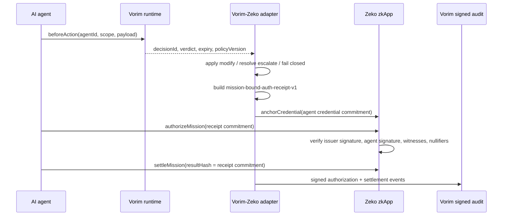

# VorimAI on Zeko

VorimAI is the trust layer for AI agents: cryptographic identity, scoped permissions, runtime control, and signed tamper-evident audit records. This demo shows how a Vorim-governed agent action can be committed into a Zeko mission flow without putting raw agent secrets, policy payloads, or private action content on-chain.

The flow is:

1. Vorim identifies the agent and evaluates a scoped runtime decision.
2. The adapter fails closed on unreachable policy, applies policy-modified payloads, and resolves escalations before settlement.
3. A `mission-bound-auth-receipt-v1` profile is Poseidon-committed as an o1js `Field`.
4. The Zeko zkApp anchors the agent credential commitment and authorizes a one-time mission bound to that receipt commitment.
5. Settlement emits the same commitment so Vorim signed audit records reconcile with Zeko state.

## What Vorim Gets From Zeko

Zeko gives Vorim a verifiable settlement and receipt layer for customers who need more than a vendor-hosted audit log. Vorim already gives agents identity, scoped permissions, runtime decisions, and signed action records. Zeko lets Vorim turn the most important parts of that trust record into compact commitments that are independently checkable without exposing regulated payloads.

For Vorim's own offering to regulated customers, that creates a stronger product story:

- **Independent audit reconciliation:** a customer, auditor, or counterparty can reconcile a Vorim `decisionId`, signed audit event, and Mission-Bound Auth receipt commitment against Zeko state.
- **Privacy-preserving proof surface:** Zeko carries commitments and roots, not raw prompts, customer data, policy payloads, secrets, or action contents.
- **Portable trust records:** Vorim's signed audit trail can become part of a `mission-bound-auth-receipt-v1` / `zk-mission-bundle-v1` package that survives outside one vendor dashboard.
- **Agent payment confidence:** when paired with x402 reserve/release, paid agent work can move toward "release on committed result" rather than "pay and trust the service."
- **Enterprise control plane upgrade:** Vorim can sell not only runtime policy checks, but verifiable policy-to-execution-to-settlement evidence for regulated AI agents.

Put simply: Vorim remains the agent trust layer; Zeko makes the trust record harder to dispute, easier to verify, and safer to share.

## V1 Shipped

This repo is a working v1 adapter demo. It ships:

- a local o1js `VorimAgentTrustRegistry` for agent credential commitments, one-time mission authorization, and settlement commitment emission;
- a Vorim runtime adapter based on the corrected TypeScript file from Vorim;
- fail-closed handling for `fallback`, resolved handling for `escalate`, and effective-payload handling for `modify`;
- Poseidon/o1js `Field` receipt commitments, not placeholder SHA strings;
- `mission-bound-auth-receipt-v1`, `zk-mission-bundle-v1`, and `mba-registry-v1` naming so the demo aligns to the existing Agent Mission-Bound Auth vocabulary;
- a local browser/CLI demo showing Vorim decision -> receipt commitment -> Zeko mission authorization -> settlement audit.

This v1 is intentionally narrow. It proves the adapter shape and the reconciliation loop. It does not replace the production Mission-Bound Auth sidecar, x402 payment contracts/facilitator flow, Magic City orchestration runtime, or Santaclawz agent network.

## V2 Unlock

The bigger v2 is where this becomes commercially interesting for Vorim customers:

- **Vorim portable signed receipt:** a real SDK/control-plane method that mints the exportable receipt bundle, instead of composing calls client-side.
- **Canonical field packing:** a shared Poseidon packing spec for Vorim decision fields, effective payload hash, policy version, expiry, x402 payment context, Mission-Bound Auth receipt fields, and Zeko settlement commitments.
- **x402 reserve/release:** use the existing x402-on-Zeko rail so funds can reserve up front and release only when the committed result/receipt satisfies the release condition.
- **Magic City orchestration:** use Magic City's execution-session model, proof queue, Zeko anchoring, and checkpoint lifecycle rather than rebuilding orchestration in this repo.
- **Santaclawz execution provenance:** when external agents are hired, use Santaclawz for discovery, signed work routing, paid execution, and return-package provenance rather than copying that network model here.
- **Offline verifier:** produce a verifier package that checks Vorim signed audit, Mission-Bound Auth bundle, x402 payment state, and Zeko settlement state together.

V2 is the product unlock: Vorim can offer regulated customers a full agent trust evidence chain, from scoped permission decision to paid execution and independently verifiable settlement.

## Architecture



## What The Contract Proves

- The agent credential was signed by the configured Vorim/Zeko issuer key.
- The same agent/scope credential was not already anchored.
- The same nullifier was not already spent.
- The public chain sees commitments only: `agentCommitment`, `scopeHash`, `authContextHash`, receipt commitment, and nullifier.
- The mission was signed by the credential-bound agent key and can only be settled once by the delegated key.

## Protocol Boundary

This repository is a Vorim adapter demo over existing Zeko ecosystem protocols. It does not invent a new protocol or rebrand Santaclawz, x402, Mission-Bound Auth, or Magic City under this project.

The demo uses the established Agent Mission-Bound Auth names `zk-mission-bundle-v1`, `mission-bound-auth-receipt-v1`, and `mba-registry-v1`; records x402 as the payment rail; records Santaclawz as the external agent rail; and treats Magic City as the compatible orchestration/runtime pattern. See [docs/PROTOCOL_INTEGRATION.md](docs/PROTOCOL_INTEGRATION.md).

Production integration should use the canonical upstream systems:

- `agent-mission-bound-auth` for passports, mission approvals, checkpoint verification, portable bundles, receipt schemas, verifier CLI, and Zeko anchoring scripts.
- `zeko-x402` for x402 payment rail metadata, EVM/Base payment compatibility, reserve/release behavior, and payment-to-proof reconciliation.
- Magic City for execution sessions, approval UX, runner boundaries, proof queues, and Zeko anchor orchestration.
- Santaclawz for external agent discovery, hire routing, paid execution, return packages, and agent reputation/provenance.

This repo should stay an adapter and demo surface. It should not grow substitute pseudo-protocols for those repos.

## Files

- `src/VorimAgentTrustRegistry.ts` - o1js smart contract for agent credential anchoring, mission authorization, and one-time settlement.
- `src/vorim-agent-identity.ts` - helper for turning a Vorim agent assertion into a privacy-preserving Zeko credential commitment.
- `src/vorim-zeko-adapter.ts` - runtime authorization adapter inspired by Vorim's corrected TS file, with fail-closed fallback handling, modified-payload capture, escalation resolution, and Poseidon receipt commitments.
- `src/mock-vorim.ts` - local Vorim runtime mock for demos without a real API key.
- `src/demo-runner.ts` - reusable local Vorim + Zeko flow used by the CLI and browser app.
- `app/` - browser demo for the runtime decision and settlement flow.
- `scripts/demo-vorim-zeko.ts` - full local Vorim decision, receipt commitment, zkApp mission, and signed audit demo.
- `scripts/demo-app-server.ts` - tiny Node server for the browser app and demo API.
- `scripts/deploy-zeko.ts` and `scripts/smoke-zeko.ts` - Zeko testnet deployment/smoke scaffolds.
- `test/` - local contract and adapter behavior tests.

## Local Run

```bash
npm install
npm test
npm run demo:vorim -- allow
npm run demo:vorim -- modify
npm run demo:vorim -- escalate
npm run demo:vorim -- fallback
```

Start the browser app:

```bash
npm run app
```

Then open `http://localhost:4173`. The app uses `MockVorimClient` by default, so it exercises the local zkApp and signed-audit flow without Vorim credentials. A real `createVorim(...)` SDK client can be passed to `authorizeZekoAction` as long as it exposes `beforeAction`, `waitForDecisionResolution`, and `emit`.

For real proofs:

```bash
PROOFS_ENABLED=true npm run demo:vorim -- allow
```

## Runtime Authorization Receipt

The demo builds a `mission-bound-auth-receipt-v1` profile after Vorim returns an executable decision:

- `fallback` never settles; the adapter throws before a mission is authorized.
- `modify` hashes and settles Vorim's `modifiedPayload`, while retaining the original intent hash for audit reconciliation.
- `escalate` must resolve through `waitForDecisionResolution`; the resolved receipt records `alg: "P-256"` to preserve the manual approval signer boundary.
- ordinary agent decisions record `alg: "Ed25519"`.

The receipt commitment is a real o1js `Field` from `Poseidon.hash(...)`. In the local demo that field is bound into `VorimMissionAuthorization.actionHash` and emitted as the settlement `resultHash`, so the signed Vorim audit trail reconciles against Zeko mission and settlement state.

## Zeko Testnet Deploy

Create `.env` from `.env.example`, fund the deployer on Zeko testnet, then run:

```bash
npm run deploy:zeko
```

Default endpoints:

- `https://testnet.zeko.io/graphql`
- `https://archive.testnet.zeko.io/graphql`

For live smoke tests:

```bash
export ZEKO_ZKAPP_ADDRESS=<fresh-deployment-address>
npm run smoke:zeko
```

The smoke script is intended for a fresh deployment because its witness stores start from empty roots.

## Production Integration

Production work is not an OAuth or liveness integration. It is the production form of the trust-layer path:

- provision or import Vorim agent identity and public-key fingerprints;
- evaluate every sensitive action through Vorim runtime control;
- export signed Vorim audit events and decision IDs;
- mint a portable `mission-bound-auth-receipt-v1` bundle with agreed field packing;
- anchor/reconcile the receipt commitment on Zeko;
- connect real x402 reserve/release and Santaclawz/Magic City orchestration where applicable.

## CTA

Use this repo as the week-one shared implementation target. The concrete next step with Vorim is to define the production "mint portable signed receipt" method and the exact Poseidon field-packing spec for Vorim decisions, modified payloads, x402 payment context, and Zeko settlement commitments.
